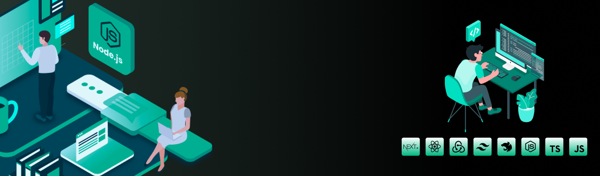

# OZmap Challenge: Construindo a Geolocalização do Futuro



## Como Instalar e Executar Localmente

Na Raiz do projeto execute após clonar o Repositorio

```bash
$ npm install
```

Criei um arquivo **.env** na raiz do projeto e preencha as configurações de acordo com seu banco de dados MySQL

```bash
MONGO_URI=mongodb+srv://administrator:<password>@ozmap.gdmph0j.mongodb.net/
```

Após configurado basta executar o comando abaixo para visualizar a aplicação

```bash
$ npm run dev
```

## Resultado esperado pelo console no terminal:

```cmd
🎉 - Servidor Online !
🔗 - http://localhost:3000
📃 - http://localhost:3000/api-docs
🎲 - Database Online !
```
